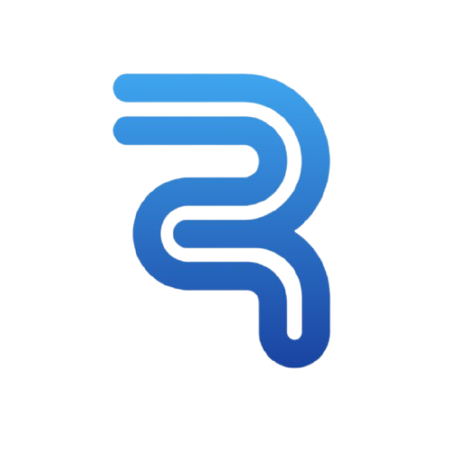

# RayUI

<div align="center">
  <a href="https://rayui.so">
    
  </a>

  <h1 align="center">RayUI</h1>

  <p align="center">
    <strong>Beautifully designed, accessible, and production-ready UI components for React.</strong>
  </p>

  <p align="center">
    <a href="https://github.com/rayyanquantum/rayui/blob/main/LICENSE.md">
      
    </a>
    <a href="https://www.npmjs.com/">
      
    </a>
    <a href="https://www.typescriptlang.org/">
      
    </a>
    <a href="https://tailwindcss.com/">
      
    </a>
  </p>
</div>

<br />

RayUI is a collection of re-usable components that you can copy and paste into your apps. It is **NOT** a component library. It's a collection of re-usable components that you can copy and paste into your apps.

## ✨ Features

- **Beautifully Designed**: Carefully crafted components that look great out of the box.
- **Accessible**: Built with accessibility in mind, ensuring your app is usable by everyone.
- **Customizable**: Built with Tailwind CSS, making it easy to customize to your needs.
- **Open Source**: Free to use for personal and commercial projects.
- **Dark Mode**: First-class support for dark mode.

## 🚀 Getting Started

To use components from this registry, configure your `components.json` file with the remote registry:

```json
{
  "registries": {
    "@rayui": "https://rayui.so/r/{name}.json"
  }
}
```

Then add components to your project using the CLI:

```bash
# Add a specific component
npx shadcn@latest add @rayui/login-01

# Add a dialog component
npx shadcn@latest add @rayui/dialog-01

# Add a sidebar component
npx shadcn@latest add @rayui/sidebar-01
```

## 🛠️ Tech Stack

- **Framework**: [Next.js](https://nextjs.org/)
- **Styling**: [Tailwind CSS](https://tailwindcss.com/)
- **Icons**: [Tabler Icons](https://tabler-icons.io/)
- **Animation**: [Framer Motion](https://www.framer.com/motion/)

## 🤝 Contributing

We welcome contributions! Please read our [contributing guide](./CONTRIBUTING.md) to get started.

## 📄 License

This UI Library is released under the **Rayyan Quantum AI Labs UI License (Custom MIT Variant)**.

You can:
- Use it in personal or commercial projects
- Use it for unlimited client work
- Remove credits and use your own branding
- Modify the components as needed

You can't:
- Resell, redistribute, license, or sub-license the library
- Use it in website builders, page builders, or automated UI generators

For full details, see the [LICENSE](./LICENSE) file.

<br />

<div align="center">
  <p>Built with ❤️ by <a href="https://rayyanquantum.ai">Rayyan Quantum AI Labs</a></p>
</div>
